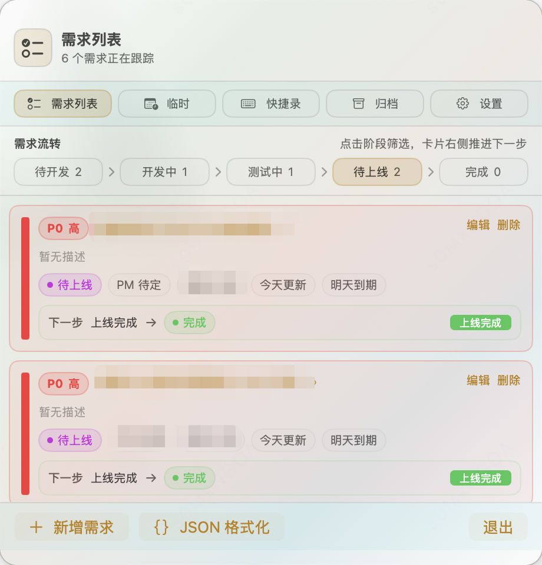

<div align="center">


# DeliveryBar

**轻量级 macOS 菜单栏需求交付追踪与开发辅助工具**

*Write code. Ship it. Never forget to deliver again.*

[](https://developer.apple.com/macos/)
[](https://swift.org)
[](https://developer.apple.com/xcode/swiftui/)
[](LICENSE)
[](CONTRIBUTING.md)

</div>

---

## 📖 这是什么？

**DeliveryBar** 是一个驻留在 macOS 菜单栏的个人需求管理与开发辅助工具，专为同时处理多个需求的开发者设计。

它解决一个常见但容易被忽视的问题：**代码写完了，却忘了交付**。

日常开发中，一个开发者经常同时维护多个需求分支——待开发、开发中、已提测、测试中、准备上线……状态多且分散在 Jira、文档、聊天记录里。DeliveryBar 把这些信息收拢到菜单栏，让你一眼看清每条需求现在处于什么阶段、有没有被遗忘。

<div align="center">
  
</div>

## ✨ 功能

- 🖥️ **菜单栏常驻** — 基于 `NSStatusItem` 常驻菜单栏，不占用 Dock 空间
- ⌨️ **全局快捷键** — `⌘⇧D` 快速显示/隐藏主面板，`⌘⇧J` 快速打开 JSON 工具
- 📋 **需求全生命周期管理** — 覆盖 `待开发 → 正在开发 → 测试中 → 待上线 → 已完成` 主流程
- 🔍 **需求搜索** — `⌘F` 按标题、描述、备注、PM 或测试人员过滤，需求列表与归档通用
- ⏰ **智能超时提醒** — 需求停滞过久或超过截止日期时，菜单栏图标显示角标，列表中展示醒目提示
- 📦 **一键归档** — 已完成的需求归档不扰，历史数据随时可查
- ✅ **待办** — 未完成事项常驻列表不丢失，已完成按天归拢，7 天滚动清理
- 📝 **日志** — 记录当天做过的事，支持按天/按周查看，一键复制成 Markdown 周报
- ⌨️ **快捷录** — 保存常用链接、脚本和文本片段，按 key 快速检索，一键打开链接或复制内容
- 📔 **备忘** — 独立窗口写长文，Markdown 边写边着色，支持截图粘贴、标签筛选与导出，删除保留 30 天
- 🧩 **JSON 工具** — 独立可缩放窗口，语法高亮 + 行号，左右分栏格式化、压缩、搜索与结构化比对，保留输入 key 顺序，最近 50 条历史
- 🎨 **精心设计的视觉系统** — 跟随系统强调色，深浅色自适应，状态色一目了然
- 🔒 **100% 本地存储** — 基于 SwiftData，无网络请求、无账号系统、无第三方追踪
- 🪶 **零外部依赖** — 纯 Apple 原生框架，不引入任何第三方库

## 🚀 快速开始

### 环境要求

| 项目 | 要求 |
|------|------|
| macOS | 26.0+ |
| Xcode | 26.0+ |
| Swift | 5.0 |

### 克隆 & 构建

```bash
# 克隆仓库
git clone https://github.com/your-username/DeliveryBar.git
cd DeliveryBar

# 用 Xcode 打开
open DeliveryBar.xcodeproj
```

然后在 Xcode 中按 `⌘ + R` 运行。应用不会显示 Dock 图标，启动后会出现在菜单栏；如果系统符号不可用，会显示 `DB` 作为兜底入口。

也可以使用命令行构建：

```bash
xcodebuild -project DeliveryBar.xcodeproj \
  -scheme DeliveryBar \
  -configuration Release \
  build
```

### 打包 DMG

```bash
./scripts/package_dmg.sh 2.0.0
```

生成的 `.dmg` 文件位于 `dist/` 目录。

### 重新生成 App 图标

```bash
swift scripts/generate_app_icon.swift
```

图标由纯代码绘制（`NSBezierPath`），无外部设计文件依赖。

## 🧭 使用指南

### 快捷呼出

| 快捷键 | 功能 |
|--------|------|
| `⌘⇧D` | 显示/隐藏主面板（全局） |
| `⌘⇧J` | 打开 JSON 工具窗口（全局） |
| `⌘F` | 在需求列表/归档中搜索 |
| `Esc` | 编辑页返回列表；列表页收起面板 |

快捷键使用系统原生 `RegisterEventHotKey` 注册。如果快捷键被其他应用占用，设置页会展示注册失败状态。

### 需求状态流转

```
待开发 → 正在开发 → 测试中 → 待上线 → 已完成
```

每条需求卡片上可以直接切换状态——点击状态旁的展开箭头，选择目标状态即可，无需进入编辑页。

`已开发，未交付` 是历史兼容状态，应用启动时会自动迁移到 `测试中`。`归档` 是完成后的收纳动作，不作为主流程阶段展示。

### 超时提醒规则

| 状态 | 触发条件 | 提示文案示例 |
|------|----------|-------------|
| 正在开发 | 超过 7 天未推进 |「7 天未推进」|
| 测试中 | 超过 5 天未处理 |「5 天测试中」|
| 待上线 | 超过 5 天未处理 |「5 天待上线」|
| 任意 | 超过截止日期 |「已逾期 N 天」|

提醒为轻量级——仅限菜单栏角标和列表内文案高亮，可在设置中全局关闭。菜单栏角标在数据保存后立即刷新。

### 待办与日志

「不属于某个需求但又得记一笔」的场景，拆成两个独立 tab：

- ✅ **待办** — 未完成的事项一直留在列表里（收件箱语义），不随日期消失；顶部日期条只用来查看某一天完成了什么
- 📝 **日志** — 记录当天做过的事。支持「日 / 周」两种视图，周视图可一键把近 7 天复制成 Markdown 周报

日志和已完成的待办以 7 天为窗口滚动清理，未完成的待办不会被清掉。

### 快捷录

保存常用的链接、脚本和文本片段，通过自定义 key 快速检索：

- 🔗 **链接** — 一键在浏览器中打开
- 💻 **脚本** — 一键复制到剪贴板
- 📄 **文本** — 常用文本片段，一键复制

支持按类型筛选、关键词搜索，高频条目自动靠前。

### JSON 工具

JSON 工具可以从主面板底部的「JSON 格式化」按钮打开，也可以按 `⌘⇧J` 直接打开。窗口顶部可以在「格式化」和「比对」两种模式之间切换。

**格式化模式**

- **格式化** — 按 2 空格缩进输出，保留输入 JSON object 的 key 顺序
- **压缩** — 去掉多余空白，仍然保留 key 顺序
- **语法高亮** — key / 字符串 / 数字 / 布尔 / null 分色，`null` 走斜体；深浅色各一套配色。着色不做语法校验，输入到一半的半截 JSON 照样有颜色
- **行号槽** — 左侧显示行号，当前行加深；搜索结果报的行列号可以直接对上
- **字号调节** — 结果区顶栏的 `A-` / `A+`，11–20 之间调，格式化和比对模式共用
- **双向可编辑** — 输入区和结果区都能直接改。改完结果直接「复制结果」即可，不必回头改原文再重新格式化。两边各有独立的撤销栈，`⌘Z` 作用于当前光标所在的那一侧；重新格式化会覆盖结果区
- **搜索** — `⌘F` 展开搜索条，可在输入区或结果区搜索内容并跳转到匹配位置
- **区域调整** — 左右分栏，默认宽度偏向结果区；拖动中间的分隔条调整比例，比例会自动保存
- **历史记录** — 格式化成功后保存到本地 SwiftData，最多保留最近 50 条
- **临时草稿** — 输入内容停手 0.6 秒后保存，保留 1 分钟；短时间内重开窗口可恢复，超时清空

**比对模式**

- 左右各输入一段 JSON，点「比对」输出结构化差异：`新增 / 缺失 / 不同`，object 按 key 匹配忽略顺序，数组按下标匹配
- 每条差异带 `$.a.b[0]` 形式的路径，可右键复制路径或整条差异
- 支持一键交换左右两侧

**窗口**

- 可自由拖拽边缘缩放，尺寸和位置自动记忆，下次打开保持不变
- 默认切换到其他应用时自动隐藏；打开「置顶」后窗口保持显示

JSON 解析使用项目内置的保序 parser，不依赖 `JSONSerialization` 重新排序 object key。非法 JSON 会显示行列错误，不会覆盖输入，也不会写入历史。

## 🏗️ 项目结构

```
DeliveryBar/
├── DeliveryBarApp.swift              # AppKit 应用入口，初始化 SwiftData、状态栏和快捷键
├── Models/
│   ├── Requirement.swift             # 核心数据模型（需求、状态枚举、搜索匹配）
│   ├── PersonProfile.swift           # PM/QA 联系人档案
│   ├── TemporaryTask.swift           # 临时任务模型（待办/日志）
│   ├── QuickEntry.swift              # 快捷录模型（链接/脚本/文本）
│   ├── Memo.swift                    # 备忘模型（含截图附件与软删除）
│   └── JSONFormatHistory.swift       # JSON 格式化历史记录
├── Views/
│   ├── DeliveryBarTheme.swift        # 设计系统（颜色、字号、间距、圆角）
│   ├── ThemeComponents.swift         # 通用样式修饰器（卡片、胶囊、悬停高亮）
│   ├── ListComponents.swift          # 列表共享组件（删除确认、紧凑任务行、日期条）
│   ├── EditorComponents.swift        # 表单共享组件（分组、输入框、历史建议）
│   ├── MenuBarView.swift             # 主面板（Tab 切换、搜索、面板高度推导）
│   ├── RequirementRowView.swift      # 需求卡片组件
│   ├── RequirementEditorView.swift   # 需求新增/编辑表单
│   ├── TodoListView.swift            # 待办视图
│   ├── TodoTaskRow.swift             # 待办行
│   ├── TemporaryTasksView.swift      # 日志视图（日/周 + 周报复制）
│   ├── QuickEntryListView.swift      # 快捷录列表视图
│   ├── QuickEntryEditorView.swift    # 快捷录新增/编辑表单
│   ├── MemoWindowView.swift          # 备忘窗口（列表 + 正文）
│   ├── MemoEditorTextView.swift      # 备忘正文编辑器（截图粘贴、光标插入）
│   ├── MarkdownSyntaxHighlighter.swift # 备忘编辑器的 Markdown 内联着色
│   ├── MarkdownView.swift            # 只读 Markdown 渲染（回收站中的备忘）
│   ├── JSONFormatterView.swift       # JSON 格式化 / 比对窗口
│   ├── JSONDiffView.swift            # JSON 比对内容区
│   ├── JSONTextComponents.swift      # 可搜索文本视图、撤销状态、分栏把手
│   ├── JSONSyntaxHighlighter.swift   # JSON 语义着色与行号槽
│   └── SettingsView.swift            # 设置页
├── Services/
│   ├── StatusBarController.swift     # NSStatusItem 菜单栏入口与角标
│   ├── FloatingPanelController.swift # 主面板和 JSON 浮动面板管理
│   ├── HotKeyService.swift           # 全局快捷键注册
│   ├── ReminderService.swift         # 超时判断与提醒逻辑
│   └── MaintenanceService.swift      # 历史状态迁移与过期任务清理
├── Utils/
│   ├── DateUtils.swift               # 日期格式化工具
│   ├── Clipboard.swift               # 剪贴板写入
│   ├── ModelContext+Save.swift       # 统一的 SwiftData 保存入口
│   ├── OrderedJSON.swift             # 保序 JSON parser 与 renderer
│   ├── JSONTokenizer.swift           # 着色用的容错 JSON 扫描器
│   ├── MarkdownParser.swift          # 块级 Markdown 解析（供只读渲染）
│   ├── MarkdownLineScanner.swift     # 着色用的行级 Markdown 扫描器
│   └── JSONDiffEngine.swift          # 结构化 JSON 差异计算
├── Assets.xcassets/                  # App 图标、强调色
├── scripts/
│   ├── package_dmg.sh                # DMG 打包脚本
│   └── generate_app_icon.swift       # 图标代码生成器
└── dist/                             # 构建产物
```

## 🛠️ 技术栈

| 模块 | 技术 |
|------|------|
| UI | SwiftUI |
| 菜单栏 | `NSStatusItem` |
| 浮动窗口 | `NSPanel` + `NSHostingController` |
| 快捷键 | Carbon `RegisterEventHotKey` |
| 持久化 | SwiftData |
| JSON | 自定义保序 parser + renderer |
| 提醒 | 本地状态判断 + 菜单栏角标 |
| 构建 | `xcodebuild` + `hdiutil` |

**零外部依赖**——项目不引入任何 Swift Package 或 CocoaPod。所有能力均由 Apple 原生框架提供，构建极其轻量。

## 🗺️ 路线图

- [x] **V1.0** — 核心状态管理、菜单栏常驻、超时提示、SwiftData 持久化
- [x] **V1.1** — 临时任务模块、联系人档案、视觉优化
- [x] **V1.2** — 快捷录模块、临时任务拆分待办/日志、面板动态高度、搜索筛选
- [x] **V1.3** — 全局快捷键、`NSStatusItem` 面板、JSON 格式化工具
- [x] **V2.0** — 备忘模块、JSON 语法高亮与左右分栏、备忘 Markdown 内联着色、排版系统收敛、macOS 26
- [ ] **V2.1** — 系统本地通知、开机自启动
- [ ] **V3.0** — Git 分支绑定、Jira/Tapd 同步、日报自动生成

详见 [prd.md](prd.md)。

## 🤝 贡献

欢迎提 Issue 和 PR。

1. Fork 本仓库
2. 创建特性分支：`git checkout -b feat/amazing-feature`
3. 提交更改：`git commit -m 'feat: add amazing feature'`
4. 推送到远程：`git push origin feat/amazing-feature`
5. 提交 Pull Request

## 📄 许可

MIT License — 详见 [LICENSE](LICENSE)。

---

<div align="center">

**Made with ❤️ for developers who ship.**

如果 DeliveryBar 帮到了你，请给个 ⭐ Star！

</div>
